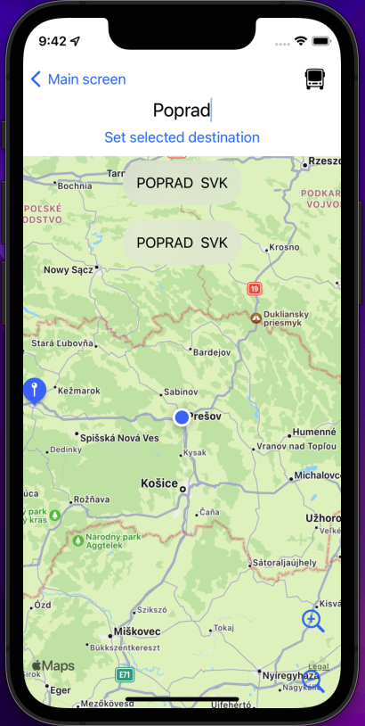
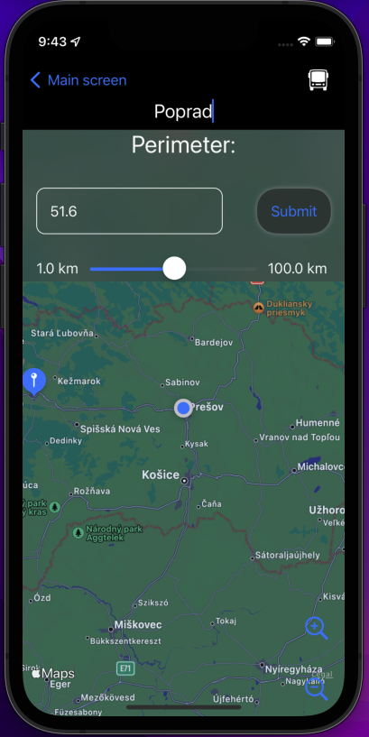

# WUT - Wake Up There  

## Table of contents  
* [General info](#General-info)
* [Technologies](#Technologies)
* [Current version](#Current-version)
    * [Description](#Description)
    * [Already implemented features](#Already-implemented-features)
    * [Main screen](#Main-screen)
    * [destination (second) screen](#destination-(second)-screen)
* [Acknowledgements](#Acknowledgements)
    * [API](#API)
    * [Inspiration](#Inspiration)
* [Contact](#Contact)

## General info
This project is a simple iOS app for notification or alarm when approaching a chosen destination, primarily based on location data.
	
## Technologies
Project is created with:
* Swift version: 5
* iOS version: 15.5
* Xcode version: 13.4.1

## Current version  

### Description  
The application is currently in the early developing stage with fundamental functionality. It is possible to select the mean of transport from 4 options (aeroplane, train, bus, boat), enter the destination (city or exact place in the city) and finally select the air distance when the app should notify you about approaching your destination.

#### Already implemented features  
- show the current position on the map
- always centre map based on your position
- zoom in or zoom out the map
- see the selected destination as a pin on the map
- a slider as user input for distance
- works in background
- plays a sound when approaching the final destination
- show scroll list of destinations based on text input
- calculate remaining distance
- support dark mode

### Main screen :  
Selection of tranport type.

### destination (second) screen :  
Entering destination name, list of possible destination over the map.

Choosing the distance from the destination by entering number or using slider:

Temporal alert showing entered input.

Final alert notifying the user about entering the set perimeter.

## Acknowledgements  

### API  
[positionstack](https://positionstack.com) - used to get the coordinates from user input

### Inspiration
This app is based on an idea of [Viktoria Husovska](https://www.linkedin.com/in/viktória-husovská-272528224/), which I would like to thank this way. 

## Contact  

author: Daniel Kosc

email: daniel.kosc@gmail.com

social: [linkedin](https://www.linkedin.com/in/daniel-košč-3b4983189/)